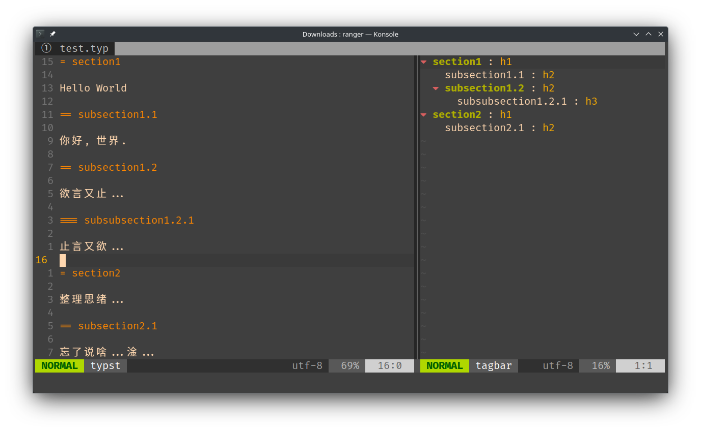

# tagbar-typst

## 简介

tagbar-typst 为 typst 文件生成 ctags. 该插件是 [lvht/tagbar-markdown](https://github.com/lvht/tagbar-markdown.git) 的一个 fork.

~~实际上就是修改了下变量名~~.

## 截图



## 安装
- [vim-plug]
```viml
Plug 'majutsushi/tagbar'
Plug 'Corona09/tagbar-typst'
```

确保安装了 **php**, 并且 `bin/typst_ctags` 拥有可执行权限.

Enjoy :)

[vim-plug]: https://github.com/junegunn/vim-plug
[dein.vim]: https://github.com/Shougo/dein.vim

~~瞎写的~~Typst 高亮插件:

[Corona/nvim-typst](https://github.com/Corona/nvim-typst.git)
